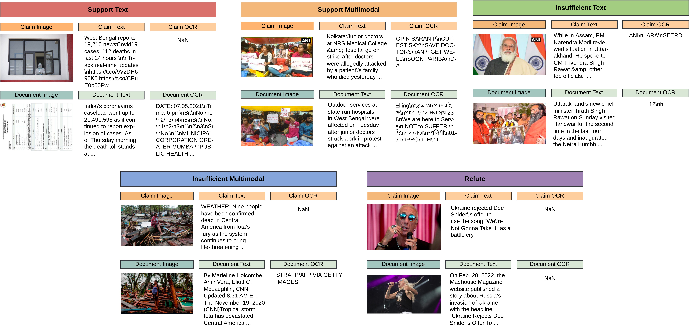
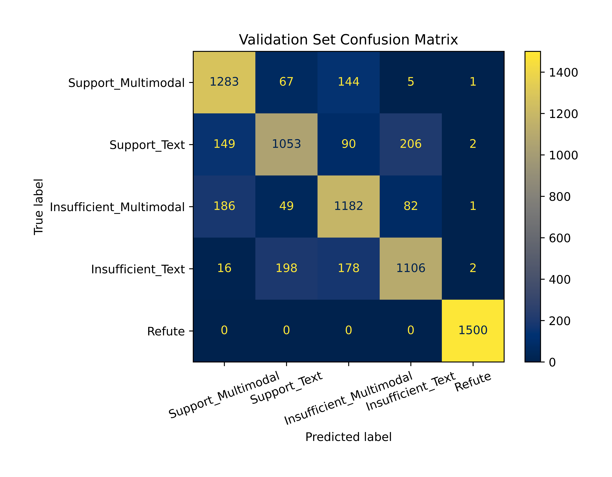
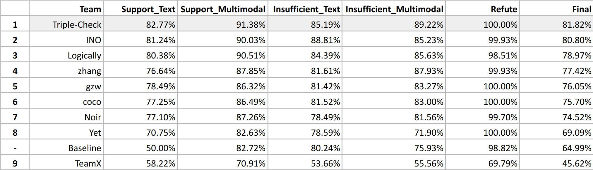

# Official code of Team Triple-Check at Multi-Modal-Fact-Verification-2023
:tada: :tada: We won the :fire:**first place**:fire: in [De-Factify workshop in AAAI-23](https://aiisc.ai/defactify2/) and please the technical report can be viewed [here](https://arxiv.org/abs/2302.07740). The brief introduction of this work can be referred to our [blog](https://medium.com/@wwweiwei/aaai-2023-parameter-efficient-large-foundation-models-with-feature-representations-for-1772a30bcf16).

- Previous verion of our model: [Pre_CoFactv1](https://github.com/wywyWang/Multi-Modal-Fact-Verification-2021)

## Task
A multimodality clssification task, where the goal is to detect support, insufficient-evidence and refute between given claims and documents.

## Usage
- Train model
    ```
    bash single_model.sh
    ```
- Evaluate model
    ```
    python evaluate.py ${model_path}
    ```
- Ensemble models
    ```
    python ensemble.py
    ```

## Dataset
- Train set: 35,000, 7,000 for each class.
- Validation set: 7,500, 1,500 for each class.
- Test set: 7,500, 1,500 for each class.
<div align="left">

</div>

- For more details, please refer to [FACTIFY: A Multi-Modal Fact Verification Dataset](https://www.researchgate.net/publication/356342935_FACTIFY_A_Multi-Modal_Fact_Verification_Dataset).

## Metric
F1 averaged across the 5 categories. The final ranking would be based on the weighted average F1 score.

## Pre_CoFactv2 Overview
<div align="left">

</div>

## Experiment Overview

<div align="left">


</div>


## Leaderboard
<div align="left">

</div>
